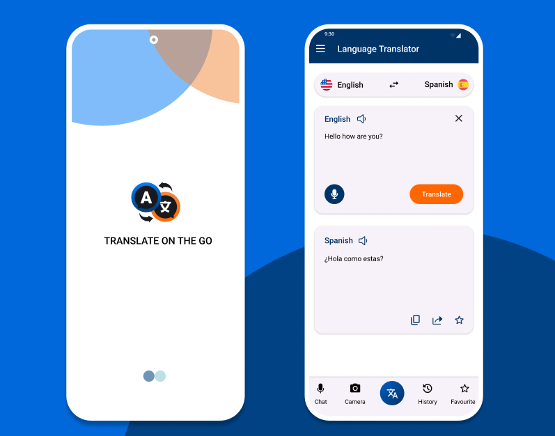

# Language Translator App

<div align="center">
  
</div>

<div align="center">
  <h3>🌐 Translate on the Go</h3>
  <p>Breaking language barriers, one translation at a time</p>
</div>

---

## 📱 About

A modern, user-friendly mobile translation application that enables seamless communication across languages. Built with a clean interface and powerful features for everyday translation needs.

## ✨ Features

- 🌐 **Real-time Translation** - Instantly translate text between multiple languages
- 🎤 **Voice Input** - Speak your text and get translations with voice recognition
- 📱 **Clean Interface** - Modern, intuitive design for easy navigation
- 🔄 **Bidirectional Translation** - Switch between source and target languages effortlessly
- 📋 **Copy & Share** - Easily copy or share translations
- ⭐ **Favorites** - Save frequently used translations
- 📷 **Camera Translation** - Translate text from images
- 📚 **Translation History** - Access your previous translations

## 🚀 Getting Started

### Prerequisites

- [Add your prerequisites here]

### Installation

1. Clone the repository
   ```bash
   git clone https://github.com/yourusername/language-translator-app.git
   ```

2. Navigate to the project directory
   ```bash
   cd language-translator-app
   ```

3. Install dependencies
   ```bash
   [Add installation commands]
   ```

4. Run the application
   ```bash
   [Add run commands]
   ```

## 🎯 Usage

1. **Select Languages**: Choose your source and target languages from the dropdown
2. **Enter Text**: Type your text in the input field or use voice input
3. **Get Translation**: Tap the "Translate" button to get instant results
4. **Save or Share**: Copy, share, or save your translations for later use

## 🛠️ Built With

- [Add your technology stack]
- [Framework/Language used]
- [Libraries/Dependencies]

## 🌍 Supported Languages

- English
- Spanish
- [Add more languages]

## 📸 Screenshots

<div align="center">
  
  <br><br>
  <em>Clean and intuitive user interface with splash screen and translation features</em>
</div>

## 🤝 Contributing

Contributions are welcome! Please feel free to submit a Pull Request.

1. Fork the project
2. Create your feature branch (`git checkout -b feature/AmazingFeature`)
3. Commit your changes (`git commit -m 'Add some AmazingFeature'`)
4. Push to the branch (`git push origin feature/AmazingFeature`)
5. Open a Pull Request

## 📝 License

This project is licensed under the MIT License - see the [LICENSE](LICENSE) file for details.

## 📞 Contact

- Email: [hosseinmasoumi3128@gmail.com](mailto:hosseinmasoumi3128@gmail.com)
- Phone: +98 935 128 8210
- Project Link: [https://github.com/yourusername/language-translator-app](https://github.com/yourusername/language-translator-app)

## 🙏 Acknowledgments

- [Add acknowledgments here]
- [Credits to libraries/resources used]

---

<div align="center">
  Made with ❤️ by Hossein Masoumi
</div>
